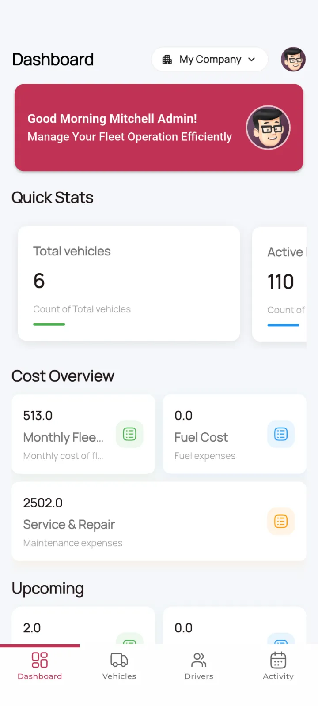
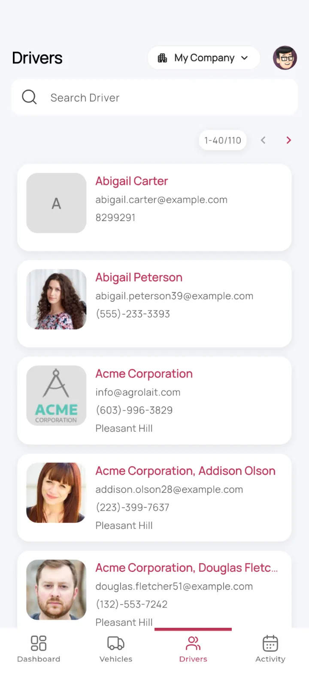
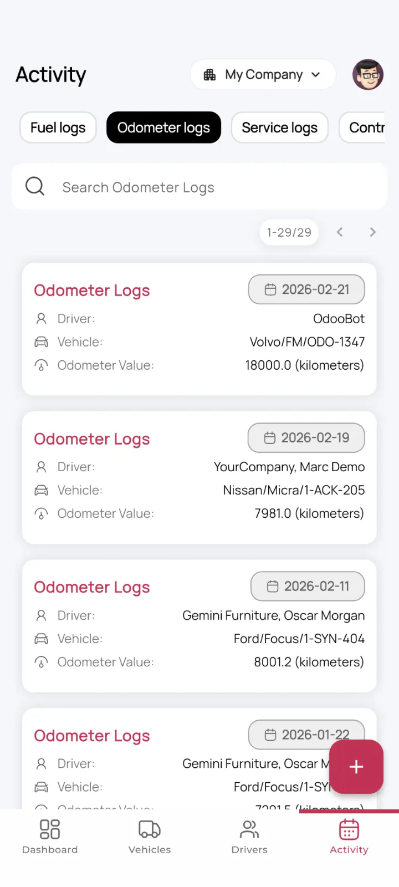
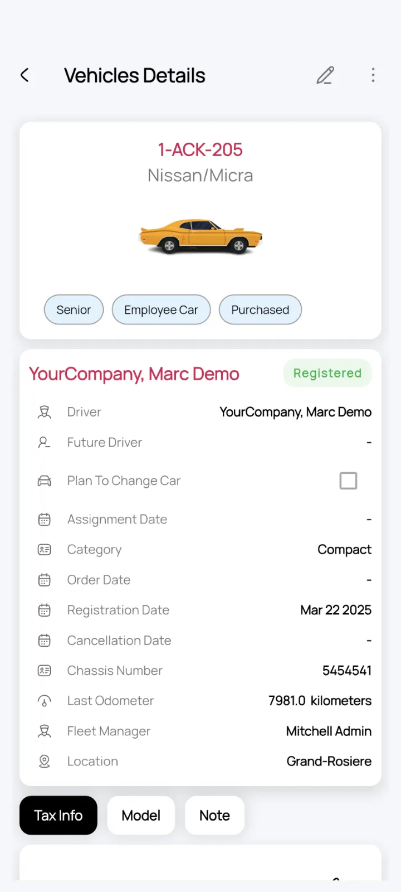

# Mobo Fleet


Mobo Fleet is a powerful mobile solution built to integrate seamlessly with Odoo, enabling businesses to manage their fleet operations with clarity and control. Built with Flutter, it delivers a high-performance, intuitive interface for tracking vehicles, monitoring drivers, managing service records, and overseeing operational costs — all directly from your mobile device.

##  Key Features

###  Vehicle Management
- **Vehicle Listings**: Browse and search all fleet vehicles with real-time data from Odoo.
- **Vehicle Details**: View comprehensive information including make, model, fuel type, odometer readings, and assigned driver.
- **Edit Capabilities**: Update vehicle information on the go directly from the app.
- **Vehicle Categories**: Organize and filter vehicles by category (car, bike, etc.).

###  Driver Management
- **Driver Profiles**: Access detailed driver information including licences, contact details, and assignment history.
- **Driving History**: View per-driver driving history and mileage overview.
- **Driver Assignment**: Link drivers to vehicles with ease.

###  Dashboard & Analytics
- **Fleet Dashboard**: High-level overview of fleet costs including fuel, service, and repair expenses.
- **Vehicle Cost Overview**: Per-vehicle cost breakdown for informed budget management.
- **Activity Log**: Full audit trail of fleet activities with advanced filtering.

###  Service & Fuel Tracking
- **Fuel Logs**: Record and review fuel fill-ups with cost tracking per vehicle.
- **Service Records**: Log maintenance and repair activities against vehicles.
- **Odometer Tracking**: Track mileage via odometer entries to monitor vehicle usage accurately.
- **Add Service / Fuel**: Quick-add forms to log service and fuel events on the fly.

### Contract Management
- **Vehicle Contracts**: View and manage contracts associated with fleet vehicles.
- **Contract Logs**: Full history of past contractual agreements per vehicle.

### Security & User Experience
- **Biometric Authentication**: Fast and secure login via fingerprint or Face ID.
- **Two-Factor Authentication**: Optional 2FA support for enhanced account security.
- **Multi-Company Support**: Switch between different Odoo company profiles effortlessly.
- **Session Management**: Secure session-based authentication with Odoo backend.
- **Dark Mode**: Fully optimized dark theme for comfortable low-light usage.
- **Offline Awareness**: Connectivity detection to gracefully handle network interruptions.

## Screenshots

<div>
  
  
  
  
</div>

## Technology Stack

Mobo Fleet is built using modern technologies to ensure reliability and performance:

- **Frontend**: Flutter (Dart)
- **State Management**: Provider
- **Backend Integration**: Odoo JSON-RPC
- **Authentication**: Local Auth (Biometrics) & Odoo Session Management
- **UI Components**: Hugeicons, Shimmer, Lottie, Carousel Slider
- **Networking**: Connectivity Plus
- **Storage**: Shared Preferences & Flutter Secure Storage
- **Media**: Image Picker, Cached Network Image, Video Player

## Supported Odoo Versions

- Tested on Odoo **17, 18, and 19** — Community & Enterprise

##  Platform Support

- Android
- iOS

##  Permissions

The app may request the following permissions:

- **Internet Access** → To sync data with the Odoo server
- **Camera Access** → To capture vehicle or document images
- **Storage Access** → To cache files and images locally
- **Biometric Access** → To enable fingerprint or Face ID authentication

## Getting Started

### Prerequisites
- Flutter SDK (Latest Stable)
- Dart SDK `^3.9.2`
- Odoo Instance (v14 or higher recommended)
- Android Studio or VS Code

### Installation

1. **Clone the repository**
   ```bash
   git clone  https://github.com/mobo-open-source/mobo_fleet.git
   cd mobo_fleet
   ```

2. **Install dependencies**
   ```bash
   flutter pub get
   ```

3. **Run the application**
   ```bash
   flutter run
   ```

### Build Release

**Android**
```bash
flutter build apk --release
```

**iOS**
```bash
flutter build ios --release
```

## Configuration

1. **Server Connection**: On first launch, enter your Odoo server URL and select your database.
2. **Authentication**: Log in using your Odoo credentials.
3. **Biometrics**: Enable fingerprint or Face ID authentication from the Settings screen for faster access.
4. **Two-Factor Authentication**: Configure 2FA from your Odoo instance for enhanced security.

## Usage

1. Open the app
2. Enter your Odoo server URL
3. Select your database
4. Log in with your Odoo credentials
5. Start managing your fleet

##  Troubleshooting

**Login failed**
- Check that the server URL is correct
- Verify the database name
- Confirm the user has the required access rights

**No data loading**
- Verify API endpoints are reachable
- Check server logs for errors
- Confirm the Fleet module is installed on your Odoo instance

## Roadmap

- Offline sync mode
- Dashboard analytics
- Barcode vehicle/asset scan
- Push notifications for service reminders

## Contributing

We welcome contributions to improve Mobo Fleet!

1. Fork the project.
2. Create your feature branch (`git checkout -b feature/NewFeature`).
3. Commit your changes (`git commit -m 'Add NewFeature'`).
4. Push to the branch (`git push origin feature/NewFeature`).
5. Open a Pull Request.

## License

This project is primarily licensed under the **Apache License 2.0**.
It also includes third-party components licensed under:

- MIT License
- GNU Lesser General Public License (LGPL)

See the [LICENSE](LICENSE) file for the main license and [THIRD_PARTY_LICENSES.md](THIRD_PARTY_LICENSES.md) for details on included dependencies and their respective licenses.

## Maintainers

- **Team Mobo** at Cybrosys Technologies
-  [mobo@cybrosys.com](mailto:mobo@cybrosys.com)
